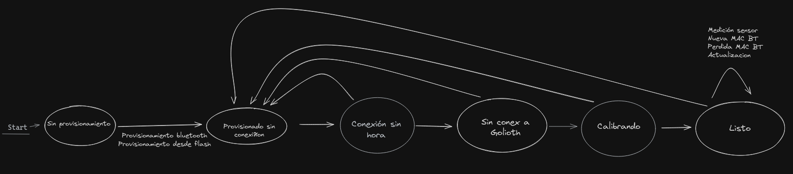

# Práctica final ANIOT | RPI1 | RPI2

# Sprint 1

- Estructura del proyecto y de la máquina de estados. Aunque el dibujo muestra la idea general, está un poco desactualizado:
    
- Componentes:
    - **mqtt**: conexión al broker y envío de datos.
    - **provision**: de momento, solo pilla las credenciales wifi del menuconfig.
    - **wifi**: conexión al wifi.
    - **sensores**: calibración y lectura de sensores.

De momento, la aplicación:
1. Coge los credenciales del wifi del menunconfig.
2. Se conecta al wifi.
3. Se conecta al broker MQTT.
4. Calibra los sensores
5. Lee los sensores de forma periódica y muestra las lecturas por pantalla.